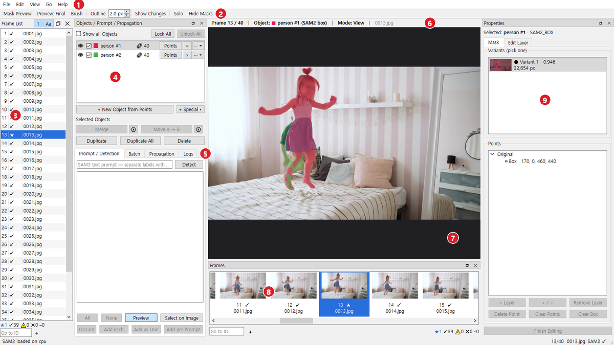
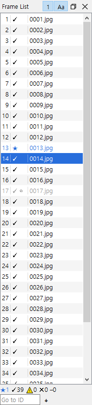
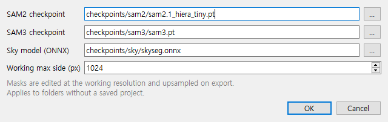

# A. 시작하기

[← 설명서 목차](README.md) · 다음: [B. 추천 워크플로 →](02-workflow.md)

## A1. 이 툴이 하는 일

3DGS 학습용 사진에는 지나가는 사람, 차, 삼각대처럼 **학습에서 빼야 할 것**이 찍혀 있습니다. 이 툴은 그런 것을 골라 프레임마다 마스크를 만들고,
학습기가 읽는 규칙(폴더, 파일 이름, 흑백의 뜻)에 맞춰 내보냅니다.

- **SAM3**: `person`처럼 글자로 대상을 찾습니다.
- **SAM2**: 클릭과 박스로 대상을 따고 다듬습니다.
- **SAM2 비디오**: 한 프레임의 마스크를 앞뒤 프레임으로 전파합니다.

작업 흐름은 **찾기 → 고르기 → 다듬기 → 전파 → 내보내기**입니다.

### 핵심 개념

| 개념 | 뜻 |
|---|---|
| **Detection** | SAM3가 글자 프롬프트로 찾은 **후보**. 골라서 Object로 추가하기 전에는 작업 대상이 아닙니다 |
| **Object** | 작업 대상 하나(예: 사람 한 명). 프레임마다 자기 마스크를 가질 수 있고, 여러 프레임에 걸치면 목록에 `🔗 N`이 붙습니다. **Object = 학습에서 무시할 것**입니다 |
| **Variant** | SAM2가 낸 마스크 후보들. 프레임마다 하나를 고릅니다 |
| **포인트 레이어** | 한 프레임의 마스크는 **Original** + **Layer 1…n**입니다. 레이어는 자기 포인트만으로 따로 만든 조각이라, 더하거나(+) 빼도(−) 원래 마스크가 망가지지 않습니다 |
| **Edit Layer** | 브러쉬와 오토 툴로 한 손질. 마스크 위에 따로 쌓여서 언제든 지우거나(Delete Layer) 굳힐(Apply Layer) 수 있습니다 |
| **Final Mask** | **체크박스가 켜진** Object들의 마스크를 합친 것. 이것이 내보내집니다 |
| **마스크 세트** | 지금 체크한 Object 묶음에 이름을 붙인 것(예: `sky`). 세트마다 따로 된 폴더로 내보낼 수 있습니다 |
| **특수 Object** | 클릭 대신 **설정값으로 만드는** Object: Sky Mask(하늘), Fisheye Lens Edge(피시아이 원 바깥) |

한 프레임에서 마스크가 만들어지는 순서:

```text
Original(포인트 · 박스 · 불러온 마스크)  ∪  더하기 레이어  −  빼기 레이어   →  Edit Layer(브러쉬 · 오토 툴) 적용  =  그 Object의 마스크
체크된 Object들의 마스크를 모두 합침                                                                                     =  Final Mask
```

> 📷 `img/01-concepts.png` — 위 관계를 그림으로(Object 두 개, 프레임 두 장, 체크 하나 끔)

## A2. 화면 구성


*창 전체: 번호는 아래 표*

| 번호 | 이름 | 하는 일 |
|---|---|---|
| ① | **메뉴 바** (File · Edit · View · Go · Help) | 모든 명령이 키와 함께 있습니다. 메뉴를 열어 보면 단축키를 배울 수 있습니다 |
| ② | **툴바** | 작업 중 자주 켜고 끄는 것만: Mask Preview · Preview: Final / Object(`X`) · Cut Out: Inside / Outside(`C`) · Checker · Brush · Outline(두께 칸) · Overlay 슬라이더(마스크 색 진하기, 값 더블클릭 = 100 %) · Show Changes · Solo · Hide Masks |
| ③ | **Frame List** | 프레임 목록(ID · 표시 · 파일 이름). 제목줄의 `1` = 선택한 Object 기준으로 표시, `Aa` = 이름을 접어 좁게 |
| ④ | **Objects** | Object 목록. 한 줄: 👁 · 체크박스 · 이름 · 🔗 · 🔒 · Points · × · ···. 아래에 **+ New Object from Points**, **+ Special ▾** 와 선택한 Object용 버튼 |
| ⑤ | **탭** | **Prompt**(SAM3로 찾기, 마우스를 올리면 Prompt / Detection) · **Batch**(여러 프레임에 한꺼번에) · **Propagation**(전파) · **Logs**(작업 기록) |
| ⑥ | **작업 상태 바** | 캔버스 위 한 줄: 지금 프레임 │ 대상 Object │ 모드(View, Points, Paint, Auto · …, Select on Image, 전파 중 …) │ 파일 이름 |
| ⑦ | **캔버스** | 이미지와 마스크. 휠 = 확대 · 축소, 가운데 드래그 또는 `Space`+드래그 = 이동 |
| ⑧ | **Frames 줄** | 썸네일 줄. Frame List와 같은 목록이라 현재 프레임, 선택, 표시가 똑같이 보입니다. 아래에 **Go to ID** 칸과 ⌖(현재 프레임으로 스크롤) |
| ⑨ | **Properties** | 고른 Object의 자세한 내용. **Mask** 탭(Variants, Points) · **Edit Layer** 탭(Brush, Auto tools) · 특수 Object면 **Special** 탭 |

- 모든 패널은 옮기거나 띄우거나 닫을 수 있고, **View → Panels**에서 다시 켭니다.
- 단축키 전체: **Help → Keyboard Shortcuts** (`F1`). 설명서에는 [D8](04-reference.md#d8-단축키-전체표)에 있습니다.

### 프레임 표시

Frame List와 Frames 줄의 표시는 프레임의 상태를 알려 줍니다.

| 표시 | 뜻 | 색 |
|---|---|---|
| `★` | 여기서 직접 편집함(키프레임, 전파의 출발점) | 파랑 |
| `✓` | 전파로 마스크가 생김 | 기본 |
| `↓` | 마스크 폴더(장면의 `masks/` 등)에서 불러온 그대로. 여기서 고치면 `★` | 기본 |
| `⚠` | 의심: 전파 중 마스크 면적이 갑자기 바뀜 | 주황 |
| `✕` | 전파 후 마스크가 비어 있음 | 빨강 |
| `–` | 제목줄 `1`이 켜져 있을 때, 선택한 Object의 마스크가 없음 | 회색 |
| `◎` | 전파 기준 프레임(주황 테두리) | — |
| `📌` | Pin으로 고정한 선택 | — |
| `⊘` | 새 데이터셋에서 뺄 프레임 | 회색 글자 |

- 지금 열린 프레임은 칸 전체가 **파랑**, Shift / Ctrl-클릭으로 고른 다른 프레임은 **옅은 파랑**입니다.
- 목록 아래와 Frames 줄 오른쪽에 개수 요약(`★3 ✓40 ⚠2 ✕0`)이 있습니다. 불러온 마스크가 있으면 `↓N`도 나옵니다.


*Frame List: 13 = ★ 키프레임, 나머지 ✓ 전파됨, 17 = ⊘ 제외(회색), 14 = 열린 프레임(파랑)*

## A3. 준비

### 실행

- 설치한 경우: 저장소 폴더의 `run.bat`. 포터블 폴더: `SAM Mask Studio.bat`.
- 처음 실행할 때 모델을 불러오느라 시간이 걸립니다. SAM2가 로딩 중이어도 포인트는 찍을 수 있고, 상태 표시줄에 `SAM2 loading… (N waiting)`으로 기다리는 수가 보입니다.
  준비되면 찍어 둔 포인트가 계산됩니다.

### 체크포인트와 Settings

File → **Settings…** 에서 모델 파일 위치를 정합니다.


*Settings 창*

| 칸 | 기본 경로 | 메모 |
|---|---|---|
| **SAM2 checkpoint** | `checkpoints/sam2/sam2.1_hiera_tiny.pt` | 클릭으로 따기, 전파 |
| **SAM3 checkpoint** | `checkpoints/sam3/sam3.pt` | 글자로 찾기. 가중치는 Hugging Face `facebook/sam3`에서 접근 승인을 받아야 받을 수 있습니다 |
| **Sky model (ONNX)** | `checkpoints/sky/skyseg.onnx` | Sky 특수 Object용(약 170 MB, Hugging Face `JianyuanWang/skyseg`). 없으면 Sky만 못 씁니다 |
| **Working max side (px)** | 1024 | 편집 해상도의 상한. VRAM이 부족하면 낮추세요. **Export는 항상 원본 해상도**입니다 |
| **Run SAM on the CPU** | 끔 | SAM2(클릭 · 전파 · Sky 마무리)와 SAM3(Detect)를 CPU로. 학습이 GPU를 쓰는 동안 브러시로 손질할 때. 클릭 · 전파는 매우 느림(SAM2 약 10배), 브러시 · 지우개는 같음. 켜면 창 제목에 `(CPU)`. 한 번만: `run.bat --cpu`, 포터블은 `SAM Mask Studio (CPU).bat` |

- 설정은 앱 폴더의 `config.local.json`에 저장됩니다.
- SAM2 tiny와 SAM3를 함께 쓰면 VRAM을 약 4 GB 씁니다(8 GB GPU에서 개발 · 시험).
- GPU가 없으면 SAM2(클릭, 전파)와 Sky는 CPU로 느리게 동작하지만, **SAM3 글자 검출(Detect / Batch)은 NVIDIA GPU가 있어야** 합니다. 이때는 **+ New Object from Points** (`N`)로 Object를 만드세요.

---

[← 설명서 목차](README.md) · 다음: [B. 추천 워크플로 →](02-workflow.md)
