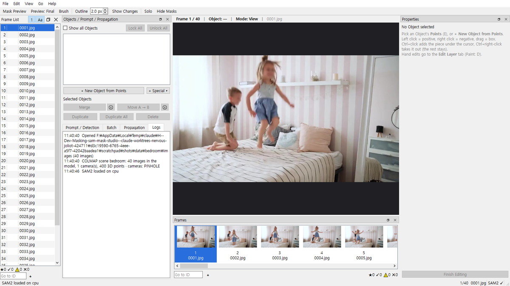
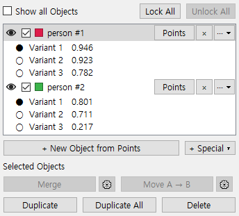
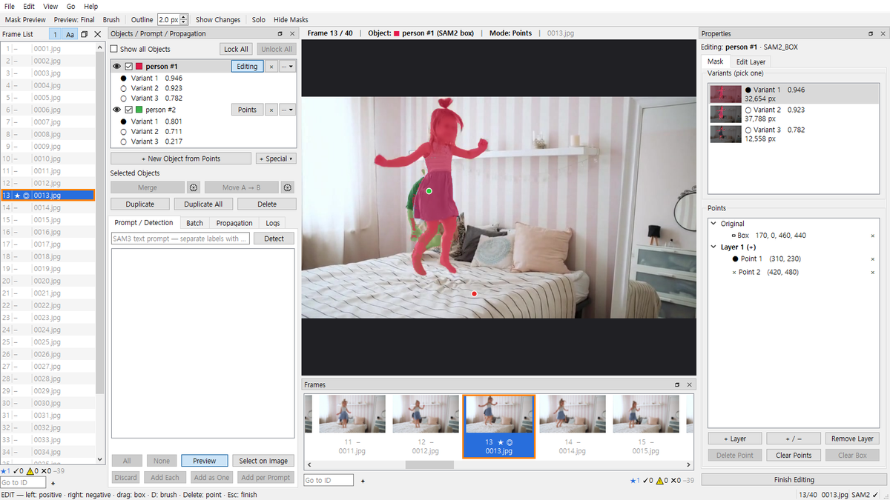
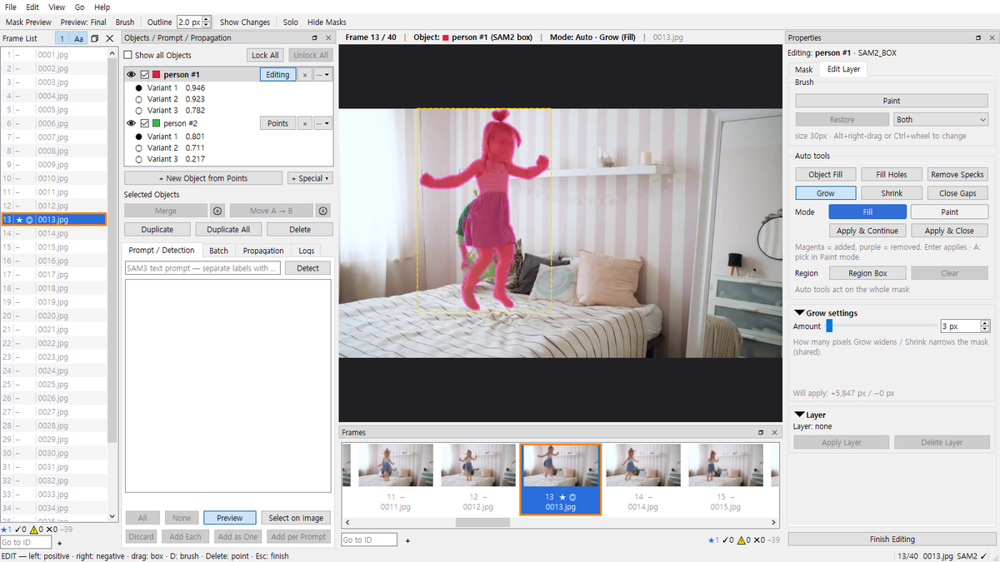
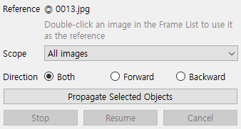
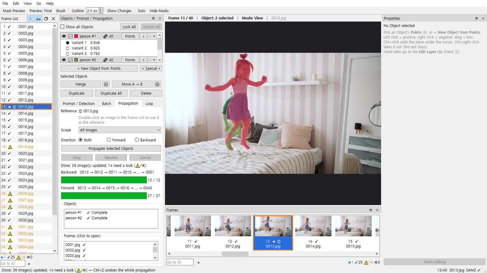
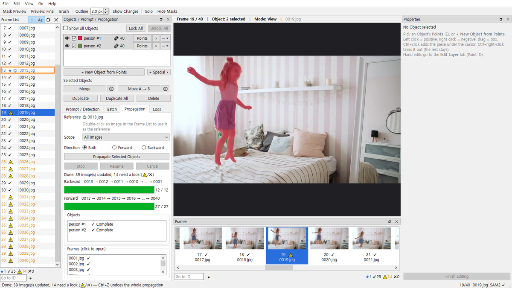
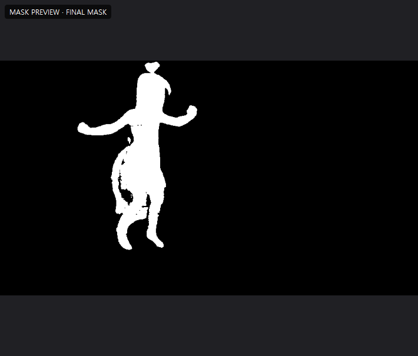
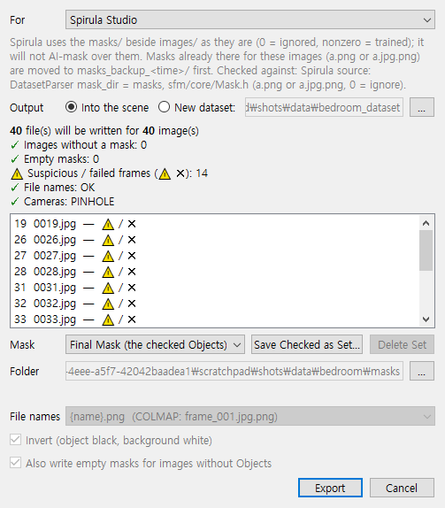
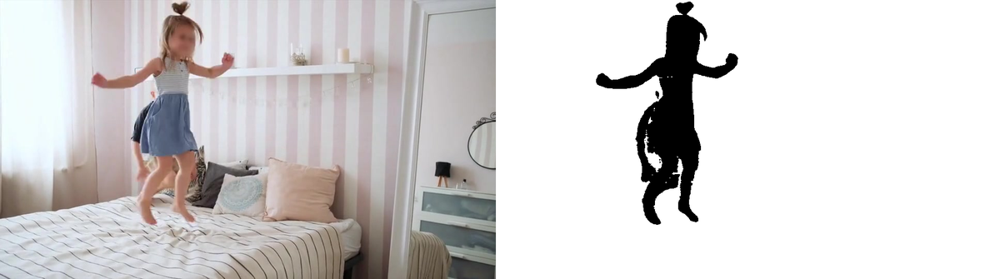

# B. 추천 워크플로 — COLMAP 장면에서 사람 지우기

[← A. 시작하기](01-getting-started.md) · [설명서 목차](README.md) · 다음: [C. 레시피 →](03-recipes.md)

사진 사이로 사람이 지나간 3DGS 촬영본에서 사람을 학습에서 빼는 마스크를 만들고, **Spirula Studio**로 학습할 수 있게 내보냅니다.
같은 파일을 **Brush**도 그대로 읽습니다.

```text
B1 장면 열기 → B2 Object 만들기 → B3 다듬기 → B4 전파 → B5 검수 → B6 Export
```

**예시 장면** `bedroom/`: `images/`에 사진 40장, `sparse/0/`에 COLMAP 모델이 있는 장면이고, 아이 두 명이 침대 위에서 움직입니다.
실제 촬영본에서는 지나가는 사람이 이 자리에 들어갑니다.

> 그림의 이미지는 SAM2 저장소의 예제 영상 `bedroom`(Apache 2.0, 얼굴은 원본에서 흐림 처리됨)에서 5장마다 한 장을 뽑은 것입니다.
> COLMAP 모델은 그림을 위해 만든 것이라 포즈와 3D 점이 실제 값이 아닙니다. 모델은 GPU 없이(CPU) 돌렸습니다.

```text
bedroom/
├─ images/      0001.jpg … 0040.jpg
└─ sparse/0/    cameras.bin  images.bin  points3D.bin
```

---

## B1. 장면 열기

**상황**: COLMAP 결과가 있는 장면 폴더를 엽니다.

**조작**

1. File → **Open Folder…** (`Ctrl+O`).
2. **장면 루트**(`bedroom/`)를 고릅니다. 그 안의 `images/`를 골라도 됩니다.

**확인할 것**

- **Logs** 탭에 COLMAP 장면 요약이 나옵니다: 모델의 이미지 수, 카메라 수와 카메라 모델, 3D 점 수.
  모델과 `images/`가 맞지 않는 이미지가 있으면 ⚠ 로그에 앞의 몇 개 이름이 나옵니다.
- Frame List에 40줄, Frames 줄에 썸네일 40개가 보입니다. 목록의 숫자는 이미지 ID(1부터)입니다.
- 장면 **옆**에 작업 파일 폴더 `bedroom.sms/`가 생깁니다. 작업은 여기에 자동 저장되고(`Ctrl+S`로 바로 저장도 가능), 다음에 장면을 열면 이어서 합니다.
  학습기가 장면 폴더를 통째로 읽기 때문에 작업 파일은 장면 안에 두지 않습니다.


*장면을 연 직후: Logs 탭의 장면 요약(이미지 수, 카메라, 3D 점)과 Frame List*

- 장면에 `masks/`가 이미 있으면 Object로 불러올지 묻는 창이 뜹니다: [C4](03-recipes.md#c4-이미-있는-마스크-고치기).
- `images/` 아래 `cam0/`, `cam1/` 같은 하위 폴더의 이미지도 열립니다: [D5](04-reference.md#d5-colmap-장면--특수-object).
- 장면이 아닌 보통 이미지 폴더도 같은 방법으로 엽니다(작업 파일은 `<폴더>.sms/`).

## B2. Object 만들기

**상황**: 사람이 잘 보이는 프레임 하나에서 사람들을 Object로 만들고, 그 프레임을 전파의 기준으로 삼습니다.

**조작**

1. Frame List에서 사람이 잘 보이는 프레임을 엽니다(클릭, 또는 `←` `→`).
2. **Prompt / Detection** 탭의 입력칸에 `person`을 쓰고 **Detect**(또는 `Enter`).
   쉼표로 여러 개를 한 번에 찾을 수 있습니다: `person, tripod`.
3. 후보가 라벨별로 묶여 목록에 나오고, **Select on Image**가 켜집니다. 캔버스에서 고릅니다:
   - 클릭 / 드래그 = 후보 추가(드래그 박스에 조금이라도 걸리면 대상)
   - `Shift`+클릭 / 드래그 = 토글, `Ctrl`+클릭 / 드래그 = 빼기
   - 목록의 체크박스, **All** / **None** 버튼으로도 고릅니다. **Preview**는 후보 표시를 켜고 끕니다.
4. **Add Each**를 누릅니다(체크한 후보마다 Object 하나).
   - **Add as One**: 체크한 후보를 모두 합쳐 Object 하나.
   - **Add per Prompt**: 라벨마다 Object 하나.
   - **Discard**: 후보를 버립니다.
5. 이 프레임을 **전파 기준 ◎**으로 정합니다: Frame List에서 **더블클릭**(또는 `Enter`).

**확인할 것**

- Objects에 `person #1`, `person #2` …가 생기고 체크박스가 켜져 있습니다.
- 이 프레임에 `★`, 칸에 주황 테두리 `◎`가 보입니다.

> 📷 `img/02-detect-candidates.png` — `person`으로 찾은 후보들, Select on Image가 켜진 캔버스


*Object 두 개가 생긴 Objects 목록(아래에 각 Object의 Variant 행)*

**다른 방법**

- **+ New Object from Points** (`N`): 누른 뒤 캔버스를 클릭하거나 박스를 드래그하면 SAM2로 Object 하나를 만듭니다. SAM3가 못 찾는 물체에 씁니다.
- **Batch** 탭: 여러 프레임(**All images** / **Range (Start ~ End)** / **Selected images**)에 프롬프트를 한꺼번에 돌려 **라벨마다 Object 하나**를 만듭니다(프레임마다 그 라벨 후보의 합).
  **Min score**보다 낮은 후보는 무시합니다. **Run on Images**로 시작, **Stop** = 여기까지 남기기, **Cancel** = 전부 버리기.
  사람을 한 사람씩 나눌 필요가 없으면 이것이 가장 빠릅니다. 이때는 B4 전파를 건너뛰고 B5 검수로 갑니다.

> 그냥 캔버스를 클릭해서는 Object가 생기지 않습니다. 항상 Detect 후 Add, 또는 **+ New Object from Points**로 만듭니다.

## B3. 다듬기

**상황**: 후보 마스크가 발이나 가방을 놓쳤거나, 옆 사물까지 먹었습니다.

### 포인트로 다듬기

1. Objects 목록의 그 줄에서 **Points**를 누릅니다(또는 줄을 고르고 `E`). 줄의 버튼이 **Editing**으로 바뀝니다.
2. 캔버스에서:
   - 좌클릭 = Positive(포함), 우클릭 = Negative(제외), 드래그 = Box
   - 포인트를 드래그하면 이동, 더블클릭하면 삭제(또는 골라서 `Delete`)
3. SAM2가 낸 다른 후보를 보려면 Properties → **Mask** 탭의 **Variants (pick one)**에서 고릅니다.

### 원래 마스크를 지키며 조각 더하기 · 빼기: 포인트 레이어

불러온 마스크나 전파된 마스크에 포인트를 찍으면, 원래 마스크를 그대로 둔 채 **Layer 1 (+)**가 자동으로 생기고 거기에 찍힙니다.
직접 레이어를 다룰 때는 Properties → Mask 탭의 **Points** 트리를 씁니다.

- **+ Layer**: 더하기 레이어를 새로 만들고 지금 레이어로 삼습니다.
- **+ / −**: 지금 레이어를 더하기 ↔ 빼기로 바꿉니다. 빼기 레이어에서는 +포인트가 "뺄 조각"을 고릅니다.
- **Remove Layer**: 지금 레이어와 그 조각을 지웁니다.
- 트리의 줄을 누르면 그 레이어로 옮겨 갑니다(굵게 표시). 캔버스에는 지금 레이어의 포인트만 보입니다. 포인트마다 있는 **×**로 하나씩 지웁니다.

한 번의 클릭으로 끝내고 싶으면: `Ctrl`+클릭 = 그 자리의 조각을 **더하기**, `Ctrl`+우클릭 = **빼기**(Edit Layer에 쌓임).


*Points 트리: Original(박스)과 Layer 1 (+)의 + 점(아이) · − 점(침대)*

### 브러쉬와 오토 툴: Edit Layer

- **Brush** (`D`): 드래그 = 칠하기(추가), `Alt`+드래그 = 빼기. 크기는 `Alt`+우클릭 드래그(오른쪽 = 크게), `Ctrl`+휠 또는 `Shift`+휠.
  **Restore**: 칠한 곳의 손질을 되돌립니다(**Add** / **Subtract** / **Both**).
- **Auto tools** (Edit Layer 탭): **Object Fill**(물체 경계까지 넓히기) · **Fill Holes** · **Remove Specks** · **Grow** · **Shrink** · **Close Gaps**.
  1. 도구 버튼을 누르면 **Fill** 모드로 시작해, 결과 전체를 미리 보여 줍니다(마젠타 = 더해질 곳, 보라 = 빠질 곳).
  2. 일부만 쓰려면 **Paint** 모드로 바꿔 쓸 부분을 칠해서 고릅니다(`Alt`+드래그 = 해제).
  3. **Apply & Continue** (`Enter`) = 반영하고 다음 결과 계산, **Apply & Close** (`Shift+Enter`) = 반영하고 도구 끝.
     `Esc`, 다른 도구, 같은 도구 버튼을 다시 누르면 반영하지 않고 나갑니다.
  - **Region Box**: 캔버스에 박스를 드래그하면 오토 툴이 그 안에서만 동작합니다(`Alt`+드래그 = 박스 빼기, **Clear** = 지우기).
  - 설정값(Max size, Amount, Max gap …)은 **Settings** 칸에 있습니다.
- **Apply Layer**: 손질을 굳혀 기본 마스크로 만듭니다. **Delete Layer**: 손질을 전부 버립니다.


*Grow의 Fill 모드 미리보기: 마젠타 = 더해질 곳, 아래 Will apply에 바뀔 픽셀 수*

**확인할 것**

- 툴바 **Outline** (`O`): 편집 중인 마스크의 흰 외곽선. **Show Changes** (`R`): 손질한 부분을 초록(추가) / 빨강(제거)으로.
- 끝나면 **Finish Editing** (`Esc`). 이 프레임에 `★`가 붙어 있습니다.
- 편집 중에도 `←` `→`로 다른 프레임에 가면 같은 Object를 거기서 이어서 편집합니다. `↑` `↓`는 이 프레임의 이전 / 다음 Object로 편집 대상을 바꿉니다.

## B4. 전파

**상황**: 기준 ◎ 프레임의 사람 마스크를 나머지 프레임으로 옮깁니다.

**조작**

1. Objects에서 전파할 Object들을 **선택**합니다(줄 클릭, `Shift` / `Ctrl`+클릭). 아무것도 선택하지 않으면 체크된 Object 전체가 전파됩니다.
2. **Propagation** 탭에서:
   - **Reference**: ◎ 프레임이 맞는지 확인합니다(정하지 않았으면 지금 프레임).
   - **Scope**: **All images**. 다른 선택: **Selection (Frame List)**(Shift / Ctrl-클릭으로 고른 프레임, **📌 Pin**으로 고정) · **Range (Start ~ End)** · **Custom (IDs: 1-4, 35, 23)**.
   - **Direction**: **Both**(앞뒤 모두). **Forward** / **Backward**도 있습니다.
3. **Propagate Selected Objects**.

**전파 중**

- 방금 끝난 프레임과 그 마스크가 캔버스에 바로 보입니다. 탭 아래 **Objects** / **Frames (click to open)** 목록에 진행이 나옵니다.
- **Stop**: 그 자리에서 멈춥니다. 결과는 남고 **Resume**으로 이어서 합니다.
- **Cancel**: 지금까지의 결과는 **남기고** 원래 보던 프레임으로 돌아가며 작업이 끝납니다.
- 결과를 통째로 없애려면 `Ctrl+Z`. 전파 한 번이 Undo 한 단계입니다.

**확인할 것**

- Frame List에 `✓`(전파됨), `⚠`(면적 급변), `✕`(빈 마스크)가 붙고 개수 요약이 바뀝니다.


*Propagation 탭(Reference, Scope, Direction)*


*전파가 끝난 Propagation 탭: 방향별 막대, Objects / Frames 결과, Frame List의 ✓ ⚠*

## B5. 검수

**상황**: `⚠` `✕` 프레임과 눈에 띄는 실수를 고칩니다.

**조작**

1. `]` / `[`: 다음 / 이전 **문제 프레임**(`⚠` `✕`)으로 갑니다. 끝에서는 처음으로 돌아갑니다.
2. B3처럼 고칩니다. 고친 프레임에는 `★`가 붙습니다.
3. 뒤쪽이 줄줄이 틀렸다면, 고친 프레임을 기준 ◎로 두고(더블클릭 / `Enter`) **Scope**를 **Range**로 좁혀 다시 전파합니다.

**잘 보는 법**

| 보기 | 조작 |
|---|---|
| 흑백으로 보기 | **Mask Preview** (`V`) 켜기 / 끄기, `Z`를 누르고 있는 동안만 보기. 흑백인 채로 편집도 됩니다 |
| 무엇을 흑백으로 | **Preview: Final / Object** (`X`): Final Mask 전체 ↔ 선택한 Object만 |
| 한 Object만 색 | **Solo** (`Q`): 선택한 Object(와 편집 중인 것)만 색칠 |
| 맨 이미지 | **Hide Masks** (`H`): 모든 색을 끔 |
| 한 Object만 숨기기 | 그 줄의 **👁**. 체크박스(Final Mask에 넣기)와 따로이고, 저장되지 않습니다 |
| 한 Object 기준 표시 | Frame List 제목줄 **`1`**: 선택한 Object의 표시만, 그 Object가 없는 프레임은 `–` |
| 키프레임 오가기 | `,` / `.`: 이전 / 다음 `★`. `F`: 기준 ◎로 |

**확인할 것**

- 개수 요약의 `⚠` `✕`가 0이거나, 남은 것은 확인하고 괜찮다고 본 것뿐입니다.


*`]`로 ⚠ 프레임(19)에 온 모습: Frame List와 Frames 줄의 주황 ⚠*


*Mask Preview: Final Mask를 흑백으로(여기서는 흰색 = Object)*

## B6. Export: Spirula Studio · Brush

**상황**: 사람 마스크를 장면에 써서 학습기가 바로 읽게 합니다.

**조작**

1. File → **Export Final Masks…** (`Ctrl+E`).
2. **For**: **Spirula Studio**.
3. **Mask**: **Final Mask (the checked Objects)**.
4. **Output**: **Into the scene**.
5. 창의 **검사** 목록을 봅니다: 저장될 파일 수, 마스크 없는 이미지, 빈 마스크, `⚠` `✕` 프레임, 파일 이름 충돌, 카메라 모델, 백업될 파일 수.
   문제 이미지 목록에서 **더블클릭**하면 창이 닫히고 그 이미지로 갑니다.
6. **Export**. 진행 창에 단계와 `n / 전체`가 나오고, 끝나면 Logs에 결과가 남습니다.

**결과**

```text
bedroom/
├─ images/
├─ sparse/0/
├─ masks/                        ← 새로 씀: 0001.jpg.png … 0040.jpg.png
└─ masks_backup_<시각>/          ← 덮어쓸 파일이 있었을 때만
```

- 파일 이름은 `<이미지 이름>.png`(예: `0001.jpg.png`)입니다. 장면에 이미 `0001.png` 식의 마스크가 있었으면 그 규칙을 따르고, 옛 파일은 백업으로 옮겨 이미지마다 한 파일만 남깁니다.
- **사람 = 검정(학습에서 무시), 나머지 = 흰색**. 사람이 없는 프레임도 모두 흰색 파일로 씁니다.
- 원래 있던 마스크는 먼저 `masks_backup_<시각>/`으로 옮깁니다(하위 폴더 구조 유지). `images/`와 `sparse/`는 건드리지 않습니다.

**학습기에서**

- **Spirula Studio**: `images/` 옆의 `masks/`를 그대로 씁니다(0 = 무시). 마스크가 있으면 Spirula가 자체 AI 마스킹을 하지 않습니다.
- **Brush**: 같은 `masks/`를 스스로 찾아 읽습니다(검정 = 무시, 흰색 = 학습). **For**를 **Brush**로 바꿔도 쓰이는 파일은 같고, 안내 문구와 검사만 달라집니다.


*For = Spirula Studio, Output = Into the scene, 검사 목록*


*한 프레임과 그 프레임의 마스크(`masks/0013.jpg.png`): 사람 = 검정*

**이어서**

- 흐리거나 필요 없는 프레임을 빼고 학습하려면: [C6](03-recipes.md#c6-흐린-프레임-빼고-학습) (⊘ + New dataset)
- Postshot은 흑백이 반대입니다: [C7](03-recipes.md#c7-postshot)
- 하늘도 빼려면 [C2](03-recipes.md#c2-하늘-따로-빼기), 360 · 피시아이 장면이면 [C8~C10](03-recipes.md#c8-360erp--pinhole)

---

## 자주 하는 실수

| 증상 | 원인과 해결 |
|---|---|
| 내보낸 마스크에 어떤 사람이 빠짐 | 그 Object의 **체크박스**가 꺼져 있음. 체크된 Object만 Final Mask에 들어갑니다. 👁은 보기만 바꿉니다 |
| 전파했는데 어떤 Object는 그대로 | 전파는 **선택한** Object만 합니다(아무것도 선택 안 했을 때만 체크된 전체). 기준 ◎ 프레임에 그 Object의 마스크가 있어야 합니다 |
| Cancel했는데 결과가 남아 있음 | 전파의 Cancel은 결과를 남기고 끝냅니다. 없애려면 `Ctrl+Z`. (Batch 탭의 Cancel은 전부 버립니다) |
| Points를 눌러도 편집이 안 됨 | **Select on Image**가 켜져 있으면 편집에 들어갈 수 없습니다. 후보를 Add하거나 Discard하세요 |
| 캔버스를 클릭했는데 Object가 안 생김 | 먼저 **+ New Object from Points** (`N`)를 누르세요 |
| 오토 툴을 쓰다가 다른 프레임으로 못 감 | Paint 모드에서 골라 둔 부분이 아직 안 써짐. `Enter` = 쓰기, `Esc` = 버리기 |
| ⊘로 뺀 프레임이 여전히 학습됨 | ⊘는 **New dataset**으로 내보낼 때만 빠집니다. Into the scene은 원본 장면이라 뺄 수 없습니다 |
| 특수 Object(Sky 등)를 편집 · 전파할 수 없음 | 특수 Object는 설정값으로 만들어서 손으로 못 고칩니다. Special 탭의 **Apply (make it an ordinary Object)** 후에 편집합니다 |

---

[← A. 시작하기](01-getting-started.md) · [설명서 목차](README.md) · 다음: [C. 레시피 →](03-recipes.md)
